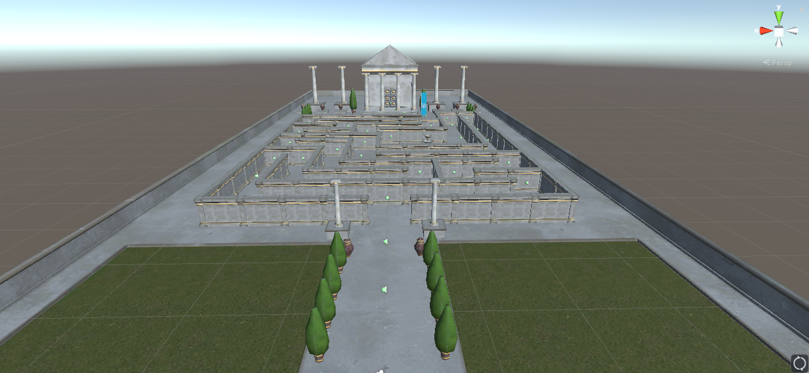

# The Maze
### by Esteban Struve

This project is a my first VR game in Unity3D. It is created as a project inside Udacity's VR Developer Nanodegree Program.

It is a maze to completed by moving with waypoints. These are floating spheres you click to move to the spot.

Inside you find animated coins you will be collecting for fun and at the end of the maze the door to the temple only opens with a key.

Your mission to win the game is to find that key and unlock the door to get out of the maze and inside the temple.

For more information: www.uxin3d.com

